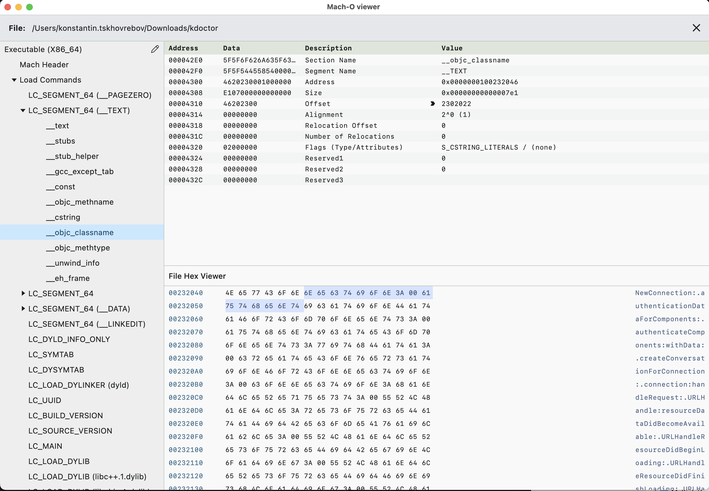

# Mach-O Viewer (Nucleus fork)

Fork of [terrakok/Mach-O-viewer](https://github.com/terrakok/Mach-O-viewer) powered by [Nucleus](https://github.com/kdroidFilter/Nucleus), with GraalVM Native Image support for faster startup and lower memory usage.



## Installation

Run the install script:

```bash
curl -fsSL https://raw.githubusercontent.com/kdroidFilter/Mach-O-viewer/main/install.sh | bash
```

Or download manually from the [Releases](https://github.com/kdroidFilter/Mach-O-viewer/releases) page.
